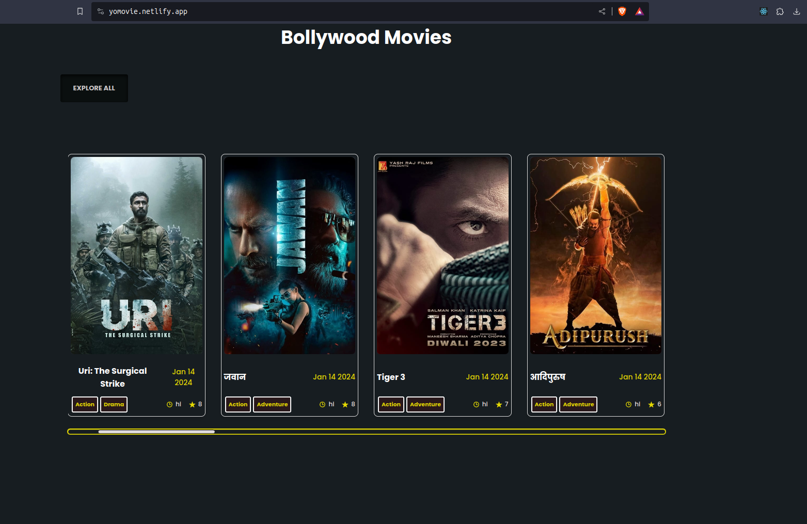

<h1 align="center">Movie-Hunt</h1>
Yomovie is a React-based movie website that allows users to search for movies by title, view trending and upcoming movies. The website is designed to be user-friendly and visually appealing.
<hr/>



<hr/>

# 🍿 Features 

- Search and watch movies: users can search for movies by title and can watch them easily

- Trending Movies: displays a section for trending movies
- Upcoming movies: displays a section for upcoming movies
- Movie Details: users can view detailed information about each movie


<hr/>

# 🍿 Technology

Yomovie is built using the following technologies:

- ReactJS
- TMDB API


<hr/>

# 🍿 How to Run the Website on Your System

## Step 1: Download and Extract the Code

Firstly, download the entire website code and extract the ZIP file to a folder on your local system.

## Step 2: Obtain the TMDB Movies API Key 

Before starting the website, you will need to obtain the TMDB Movies API key . Follow these steps to obtain them and add them to your `.env` file.

### ▶️ Get TMDB API Key 

- Go to https://www.themoviedb.org/ and log in.
- Click on your user profile picture in the navigation bar, and select "Settings".
- In the settings, select "API" and generate an API key.

## Step 3: Run the Website

Open your code editor (such as VS Code) and navigate to the project directory. Then, open a terminal and run the following command:

```bash
npm run dev
```
This will start the application. Open a web browser and navigate to http://localhost:3000 to access the website.

Note: Ensure that you have carefully added the TMDB API key  to your .env file. If the .env file is not working, add all the API keys and configuration manually.

<hr/>

# 🍿 Demo 

- Check out our live demo at https://yomovie.netlify.app/ 
 


- Source code  https://github.com/Adarsha59/my_movie.git


  
# Developer Information

## Name
Adarsha Paudyal

## Contact Information
- **Email:** adarsha.pau@gmail.com
- **GitHub:** [github.com/Adarsha59/](https://github.com/Adarsha59/)


# 😍 Contribution
Contributions are always welcome, open a **Pull Request** and help us improve our project.
